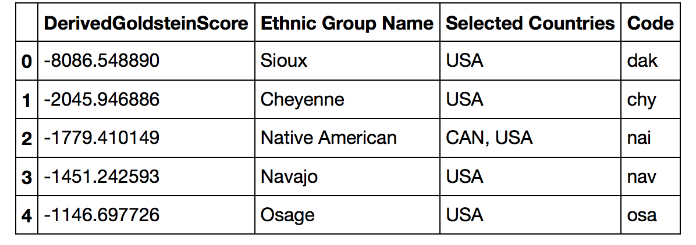
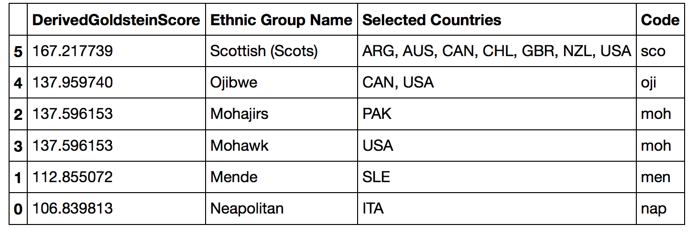

## GDELT Events data analysis

With a focus on United States, derive insights from the events around the world and study their impacts on:
- US relations with other countries
- Ethnicities impacted due events in US.
- Stability trend of other countries due to US actions.

### Fetch Dataset programmatically.
  1. Download and parse the index html page to get a list of URLs.
  2. Get the compressed .CSV files files using the URLs from HTML above.
  
### Extras
  1. The CAMEO Manual explains the standard format of capturing the event details.
  2. GDELT-Data_Format_Codebook acts as the Data Dictionary. Some of the important columns are:
    * Actor1 and Actor2 - The events are captured in the form of Actor1 did something to Actor2.
    * Geo - There are several Geo related fields that encompass the Actors' Geo as well as the Action Geo.
    * AvgTone - This is like the sentiment score of the event. The usual range is -10 to +10
    * GoldsteinScale - This number is fixed based on event type. For instance, riot is -10. The range is -100 to +100.
    * SQLDATE - Captures the event date.
    * Religious and Ethnic codes - Further identify and classify the Actors.
    * NumArticles - How many times was a specific event published.
  3. CSV.header.fieldids.xlsx contains the headers information which is missing in the CSV files. I had to read this file and join with the CSVs to produce the Pandas DataFrames.

 
### Analysis 1 - US relations with other countries (India, China, Mexico, UK, Canada)

1. Extract the compressed data files, perform filteration task to prepare DataFrame for above other countries.

2. With the help of a scatter matrix, study the relationships between some of the numerical columns - AvgTone, GoldsteinScale.

3. The AvgTone of US relations with the other countries.

4. The cumulative effect of AvgTone over time leads to apparent damaged relations.

> #### Conclusion - The mean values might seem to be only slightly negative, but it's the cumulative sum of all these negative emotions that corrode the international relationships. As it can be seen in the above graph, the relationship with Mexico is dropping very fast

### Analysis 2 - Ethnicities impacted due events in US.

1. Extract the compressed data files, perform filteration task to prepare DataFrame where Ethnic Codes are present.

2. Average of AvgTone experienced by the Ethnic groups in the US.

3. Counts of Events that had an impact on Ethnic groups in the US.

4. Most negatively impacted ethnic groups.

5. Most positively impacted ethnic groups.

> #### Conclusion - The Scottish people are happy with the US events, while the Sioux (Native Americans) are most badly impacted.

### Analysis 3 - Stability trend of other countries (India, China, Mexico, UK, Canada) due to US actions.

1. Reuse the same dataset as the first analysis.

2. Pivot the DataFrame to bring out the average GoldsteinScale for each of the above countries.

3. Perform Time Series Analysis to understand the trend of Regional Stability of these countries due to US actions.

> #### Conclusion - So far in the year 2017 US actions have caused both positive and negative impact to the stability of the above countries - India, Mexico, China, UK & Canada. Indian stability trend seems to be the most volatile due to US actions, while Canada seems to enjoy mostly stability enhancing US actions.
