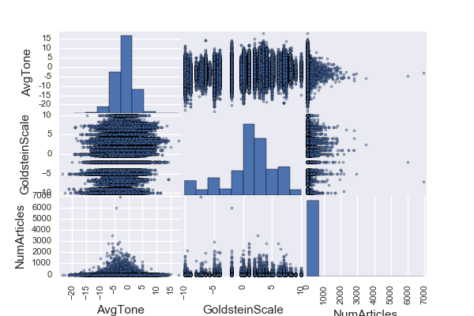
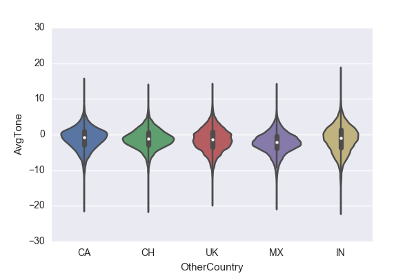
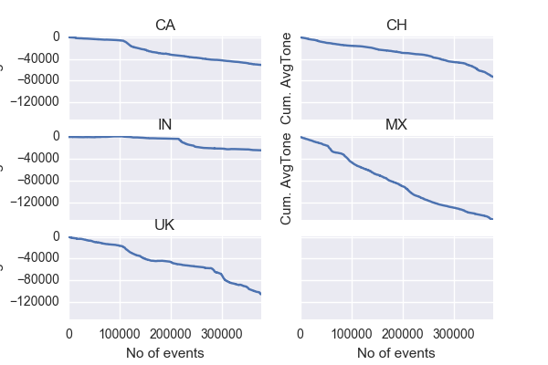
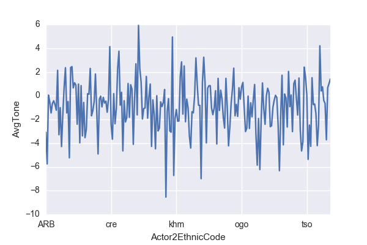
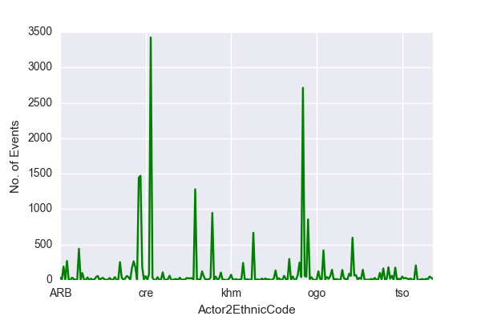

## GDELT Events data analysis

With a focus on United States, derive insights from the events around the world and study their impacts on:
- US relations with other countries
- Ethnicities impacted due events in US.
- Stability trend of other countries due to US actions.

### Fetch Dataset programmatically.
  a. Download and parse the index html page to get a list of URLs. 
  b. Get the compressed .CSV files files using the URLs from HTML above.
 
### Analysis 1 - US relations with other countries

### Analysis 2 - Ethnicities impacted due events in US.

### Analysis 3 - Stability trend of other countries due to US actions.
  
