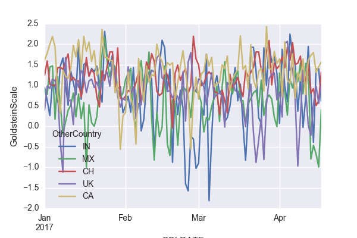

## GDELT Events data analysis

With a focus on United States, derive insights from the events around the world and study their impacts on:
- US relations with other countries
- Ethnicities impacted due events in US.
- Stability trend of other countries due to US actions.

### Fetch Dataset programmatically.
  a. Download and parse the index html page to get a list of URLs. 
  b. Get the compressed .CSV files files using the URLs from HTML above.
 
### Analysis 1 - US relations with other countries

> #### Conclusion - The mean values might seem to be only slightly negative, but it's the cumulative sum of all these negative emotions that corrode the international relationships. As it can be seen in the above graph, the relationship with Mexico is dropping very fast

### Analysis 2 - Ethnicities impacted due events in US.

> #### Conclusion - The Scottish people are happy with the US events, while the Sioux (Native Americans) are most badly impacted.

### Analysis 3 - Stability trend of other countries due to US actions.
  

> #### Conclusion - So far in the year 2017 US actions have caused both positive and negative impact to the stability of the above countries - India, Mexico, China, UK & Canada. Indian stability trend seems to be the most volatile due to US actions, while Canada seems to enjoy mostly stability enhancing US actions.
